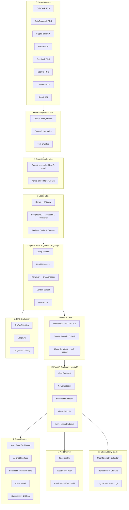
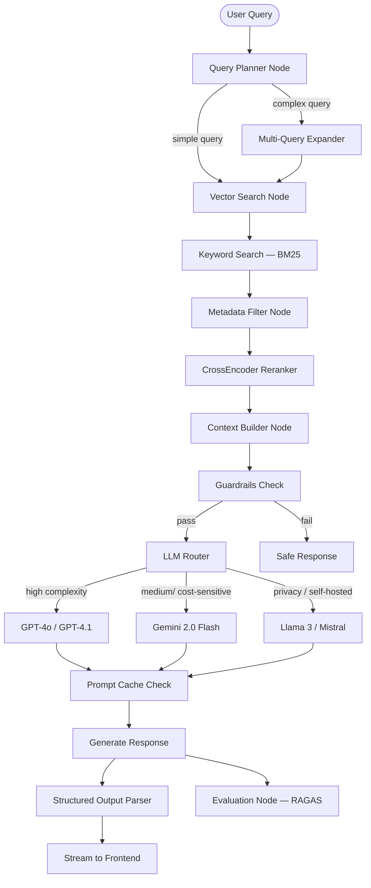

# System Architecture Document
## CRYPTOLENS-AI — AI Crypto News Analysis & Alert System

| Field | Value |
|---|---|
| Version | 2.0 |
| Date | March 2026 |
| Status | Active |
| Replaces | v1.0 (ChromaDB, single-LLM) |

---

# 1. Overview

CRYPTOLENS-AI là một nền tảng SaaS phân tích tin tức crypto theo thời gian thực sử dụng **Agentic RAG** (Retrieval Augmented Generation) kết hợp với **Multi-LLM Routing** để:

- thu thập và chuẩn hóa tin tức từ nhiều nguồn (RSS, API, social media)
- phân tích sentiment thị trường với độ chính xác cao
- tạo báo cáo phân tích rủi ro tự động
- cảnh báo người dùng theo thời gian thực qua nhiều kênh
- cho phép chat AI tương tác với nguồn tin đã được kiểm chứng

**Architecture Decisions**: Xem [docs/adr/](adr/) để biết lý do chọn từng công nghệ.

---

# 2. High-Level System Architecture



---

# 3. Agentic RAG Pipeline (LangGraph)

LangGraph orchestrates a **stateful multi-step agent** thay vì pipeline tuyến tính đơn giản.



### LLM Routing Strategy

| Trigger | LLM Selected | Reason |
|---|---|---|
| Complex multi-hop analysis | GPT-4o / GPT-4.1 | Highest reasoning |
| Standard queries, high volume | Gemini 2.0 Flash | Cost-effective, fast |
| User on Free tier | Gemini 2.0 Flash | Cost control |
| Privacy-sensitive / on-premise | Llama 3 / Mistral | No external API call |
| Fallback (API failure) | Next available LLM | Resilience |

### Embedding Models

| Scenario | Model |
|---|---|
| Production (OpenAI API available) | `text-embedding-3-small` (1536-dim) |
| Open-source / self-hosted | `nomic-embed-text` (768-dim) |

---

# 4. Data Ingestion Architecture

## 4.1 News Sources

| Source | Type | Update Frequency | Tier |
|---|---|---|---|
| CoinDesk | RSS | 15 min | Free |
| CoinTelegraph | RSS | 15 min | Free |
| CryptoPanic | REST API | 5 min | Free / Pro |
| Messari | REST API | 30 min | Pro |
| The Block | RSS | 30 min | Free |
| Decrypt | RSS | 30 min | Free |
| X/Twitter | API v2 (filtered stream) | Real-time | Pro |
| Reddit r/CryptoCurrency | Reddit API | 30 min | Free |

## 4.2 Ingestion Pipeline

```
RSS / REST API / Social Media
         ↓
   Celery: news_crawler
         ↓
   Deduplication (hash check — Redis)
         ↓
   Data Normalization (Pydantic models)
         ↓
   Raw Storage (PostgreSQL: articles table)
         ↓
   Celery: embedding_worker
         ↓
   Text Chunking (chunk_size=500, overlap=50)
         ↓
   Embedding Generation
         ↓
   Qdrant Upsert (with payload metadata)
```

## 4.3 Article Data Model

```python
class Article(BaseModel):
    id: UUID
    title: str
    content: str
    summary: str | None
    source: str                    # "coindesk" | "cointelegraph" | ...
    source_url: str
    published_at: datetime
    crawled_at: datetime
    asset_symbols: list[str]       # ["BTC", "ETH", ...]
    sentiment_score: float | None  # -1.0 to 1.0
    sentiment_label: str | None    # "positive" | "neutral" | "negative"
    risk_level: str | None         # "low" | "medium" | "high" | "critical"
    is_duplicate: bool
    embedding_id: str | None       # Qdrant point ID
```

---

# 5. Vector Database Architecture — Qdrant

Qdrant được chọn thay ChromaDB vì hỗ trợ **production-grade** với HNSW indexing, payload filtering, và horizontal scaling. Xem [ADR-001](adr/adr-001-vector-database.md).

## 5.1 Collection Schema

```
Collection: crypto_news_articles

Points:
  - id: UUID (article chunk ID)
  - vector: float[1536]           # text-embedding-3-small
  - payload:
      article_id: UUID
      source: str
      published_at: ISO8601
      asset_symbols: list[str]
      sentiment_label: str
      risk_level: str
      chunk_index: int
      chunk_text: str
```

## 5.2 Retrieval Strategy

```python
# Hybrid Search: Dense + Sparse (BM25)
qdrant_client.search(
    collection_name="crypto_news_articles",
    query_vector=dense_embedding,
    query_filter=Filter(
        must=[
            FieldCondition(key="asset_symbols", match=MatchAny(any=["BTC"])),
            FieldCondition(key="published_at", range=DatetimeRange(gte=since_24h))
        ]
    ),
    limit=20,
    with_payload=True
)
# Then rerank top-20 → top-5 with CrossEncoder
```

---

# 6. Worker Architecture (Celery + Redis)

```
Redis Broker
     │
     ├── Queue: news_crawler      → CrawlerWorker (concurrency=4)
     ├── Queue: embedding_worker  → EmbeddingWorker (concurrency=2)
     ├── Queue: sentiment_worker  → SentimentWorker (concurrency=4)
     ├── Queue: alert_worker      → AlertWorker (concurrency=2)
     └── Queue: evaluation_worker → EvalWorker (concurrency=1)
```

### Worker Schedules (Celery Beat)

| Worker | Task | Schedule |
|---|---|---|
| news_crawler | Crawl all sources | Every 15 min |
| embedding_worker | Process new articles | Every 5 min |
| sentiment_worker | Recompute sentiment | Every 1 hour |
| alert_worker | Evaluate alert rules | Every 5 min |
| evaluation_worker | Run RAGAS eval sample | Every 6 hours |

---

# 7. Backend API Architecture

Framework: **FastAPI** with async/await  
API Versioning: `/api/v1/`  
Auth: **WebAuthn (Passkeys)** — public-key credential verification; JWT issued after WebAuthn success

## 7.1 Endpoint Overview

```
# WebAuthn — Passwordless Authentication
POST   /api/v1/auth/webauthn/register/begin    — server returns PublicKeyCredentialCreationOptions
POST   /api/v1/auth/webauthn/register/complete — verify credential → store public key → issue JWT
POST   /api/v1/auth/webauthn/login/begin       — server returns PublicKeyCredentialRequestOptions
POST   /api/v1/auth/webauthn/login/complete    — verify signature → issue JWT

# Session Management
POST   /api/v1/auth/refresh                    — renew access token
DELETE /api/v1/auth/logout                     — invalidate refresh token

# Social Login (alternative)
GET    /api/v1/auth/google                     — Google OAuth2 redirect
GET    /api/v1/auth/google/callback            — Google OAuth2 callback → issue JWT

# Passkey Management
GET    /api/v1/auth/credentials                — list user's registered passkeys
DELETE /api/v1/auth/credentials/{id}           — remove a passkey

GET    /api/v1/news               — paginated news feed
GET    /api/v1/news/{id}          — article detail
GET    /api/v1/news/search        — semantic search

POST   /api/v1/chat               — AI chat (streaming SSE)
GET    /api/v1/chat/history       — conversation history

GET    /api/v1/sentiment          — market sentiment overview
GET    /api/v1/sentiment/timeline — sentiment over time
GET    /api/v1/sentiment/{symbol} — per-asset sentiment

POST   /api/v1/alerts/rules       — create alert rule
GET    /api/v1/alerts/rules       — list alert rules
DELETE /api/v1/alerts/rules/{id}  — delete alert rule
GET    /api/v1/alerts/history     — triggered alerts

GET    /api/v1/users/me           — current user profile
PUT    /api/v1/users/me           — update profile
GET    /api/v1/users/subscription — subscription status

GET    /api/v1/health             — health check
GET    /api/v1/metrics            — Prometheus metrics endpoint
```

## 7.2 Request/Response Pattern

All responses follow:

```json
{
  "success": true,
  "data": { },
  "error": null,
  "meta": {
    "request_id": "uuid",
    "timestamp": "ISO8601",
    "version": "1.0"
  }
}
```

Error responses:

```json
{
  "success": false,
  "data": null,
  "error": {
    "code": "RATE_LIMIT_EXCEEDED",
    "message": "Too many requests. Upgrade to Pro for higher limits.",
    "details": { }
  }
}
```

---

# 8. Frontend Architecture

Framework: **React 18 + Vite + TypeScript + Tailwind CSS**  
State management: **Zustand**  
Data fetching: **TanStack Query**  
Charts: **Recharts**  
Real-time: **WebSocket / SSE**

## 8.1 UI Modules

| Module | Description | User Tier |
|---|---|---|
| News Feed | Paginated news with sentiment badges | All |
| AI Chat | Streaming chat with source citations | Free (limited) / Pro |
| Sentiment Dashboard | Real-time sentiment timeline, heatmap | Free (delayed) / Pro |
| Alerts Panel | Alert rule management & history | Pro / Enterprise |
| Portfolio Tracker | Monitor assets against news | Enterprise |
| Admin Panel | User management, system metrics | Admin only |
| Billing & Subscription | Upgrade, payment history | All |

---

# 9. Alert System

## 9.1 Alert Trigger Conditions

| Condition | Description | Default Threshold |
|---|---|---|
| Sentiment Drop | Market sentiment drops rapidly | -0.3 in 1 hour |
| Negative News Surge | High volume negative articles | >5 articles, score < -0.5 |
| Critical Risk Article | Single high-risk article detected | risk_level = "critical" |
| Asset-Specific Alert | User-defined asset + keyword | Configurable |
| Volume Spike | News volume >3x baseline | Auto-detected |

## 9.2 Delivery Channels

| Channel | Free | Pro | Enterprise |
|---|---|---|---|
| WebSocket in-app push | ✅ | ✅ | ✅ |
| Telegram Bot | ❌ | ✅ | ✅ |
| Email alerts | ❌ | ✅ | ✅ |
| Webhook (custom URL) | ❌ | ❌ | ✅ |

---

# 10. Security Architecture

| Layer | Mechanism |
|---|---|
| Authentication | **WebAuthn (Passkeys)** via `py-webauthn` — no passwords stored; device public key registered; challenge signed by authenticator (Touch ID, Face ID, Windows Hello, YubiKey, Passkey sync); JWT issued after verification (access 15min / refresh 7days) |
| Authorization | RBAC (roles: free, pro, enterprise, admin) |
| Rate Limiting | Redis token bucket — per user, per tier |
| Input Validation | Pydantic strict models at all API boundaries |
| LLM Injection Guard | Prompt injection detection, content filtering |
| Secret Management | Environment variables + `.env` (never committed) |
| Data Encryption | HTTPS (TLS 1.3), encrypted secrets at rest |
| CORS | Allowlist of known origins only |
| SQL Safety | SQLAlchemy ORM — no raw SQL, parameterized queries |
| Dependency Security | `pip-audit` in CI pipeline |

---

# 11. RAG Evaluation Layer

Automated evaluation runs on sample queries every 6 hours using **RAGAS** metrics:

| Metric | Tool | Target |
|---|---|---|
| Faithfulness | RAGAS | > 0.85 |
| Answer Relevancy | RAGAS | > 0.80 |
| Context Recall | RAGAS | > 0.75 |
| Context Precision | RAGAS | > 0.80 |
| Latency (P95) | Custom | < 3s |

All LLM traces are sent to **LangSmith** for debugging and experiment tracking.  
Evaluation results stored to PostgreSQL (`rag_evaluations` table) and visualized in Grafana.

---

# 12. Observability Stack

```
Application Code
      ↓
OpenTelemetry SDK (auto-instrumentation)
      ↓
OTel Collector
     / \
    /   \
Prometheus  Jaeger (traces)
    ↓
Grafana Dashboards
```

| Tool | Purpose |
|---|---|
| OpenTelemetry | Distributed tracing, metrics, logs |
| Prometheus | Metrics scraping |
| Grafana | Dashboards (latency, error rate, token usage) |
| Jaeger | Request trace visualization |
| LangSmith | LLM-specific tracing and evaluation |
| Loguru | Structured application logs (JSON format) |

### Key Metrics Tracked

- API request latency (P50, P95, P99)
- LLM token usage and cost per request
- RAG evaluation scores over time
- News ingestion delay (crawl → vector store)
- Celery queue depth per worker
- Qdrant indexing latency
- Cache hit rate (Redis)

---

# 13. Deployment Architecture

## 13.1 Infrastructure

```
┌─────────────────────────────────────────────────────┐
│                    Production                       │
│                                                     │
│  Frontend (Vercel Edge Network)                     │
│      React + Vite — CDN cached static assets        │
│                                                     │
│  Backend (Docker — Railway / AWS ECS)               │
│      FastAPI app — 2+ replicas                      │
│                                                     │
│  Workers (Docker — Railway / AWS ECS)               │
│      Celery — 4 worker types                        │
│                                                     │
│  Databases                                          │
│      PostgreSQL — Railway Postgres / AWS RDS        │
│      Qdrant Cloud — qdrant.io (managed)             │
│      Redis — Railway Redis / AWS ElastiCache        │
│                                                     │
│  LLM APIs (external)                                │
│      OpenAI API — GPT-4o / text-embedding-3-small   │
│      Google AI API — Gemini 2.0 Flash               │
│      Self-hosted (optional) — Ollama + Llama 3      │
└─────────────────────────────────────────────────────┘
```

## 13.2 Docker Compose Services (Development)

```yaml
services:
  backend:   FastAPI app
  worker:    Celery workers (all queues)
  beat:      Celery Beat scheduler
  postgres:  PostgreSQL 16
  qdrant:    Qdrant latest (self-hosted for dev)
  redis:     Redis 7
  grafana:   Grafana
  prometheus: Prometheus
```

## 13.3 Environment Variables Required

```
# LLM
OPENAI_API_KEY
GOOGLE_API_KEY

# Database
DATABASE_URL
QDRANT_URL
QDRANT_API_KEY
REDIS_URL

# Auth — WebAuthn + JWT
JWT_SECRET_KEY
JWT_ALGORITHM=HS256
WEBAUTHN_RP_ID=cryptolens.ai
WEBAUTHN_RP_NAME=CRYPTOLENS-AI
WEBAUTHN_ORIGIN=https://cryptolens.ai

# External APIs
CRYPTOPANIC_API_KEY
MESSARI_API_KEY
TWITTER_BEARER_TOKEN
REDDIT_CLIENT_ID
REDDIT_CLIENT_SECRET

# Alerts
TELEGRAM_BOT_TOKEN

# Observability
LANGSMITH_API_KEY
LANGSMITH_PROJECT

# Billing (SaaS)
STRIPE_SECRET_KEY
STRIPE_WEBHOOK_SECRET

# App
APP_ENV=production
APP_CORS_ORIGINS=https://cryptolens.ai
```

---

# 14. Scaling Strategy

| Component | Current (MVP) | Scale-up Path |
|---|---|---|
| Backend | Single FastAPI instance | Horizontal scaling, load balancer |
| Workers | Celery on single node | Distributed Celery cluster |
| Vector DB | Qdrant Cloud (single node) | Qdrant distributed cluster |
| Database | PostgreSQL single | Read replicas, connection pooling (PgBouncer) |
| LLM | API-based (OpenAI, Google) | Multi-provider routing, local models |
| Cache | Redis single | Redis Cluster |
| Frontend | Vercel Edge | Already globally distributed |

---

# 15. Architecture Decision Records

| ADR | Decision | Status |
|---|---|---|
| [ADR-001](adr/adr-001-vector-database.md) | Use Qdrant over ChromaDB/Pinecone | Accepted |
| [ADR-002](adr/adr-002-llm-providers.md) | Multi-LLM routing strategy | Accepted |
| [ADR-003](adr/adr-003-rag-framework.md) | LangGraph for Agentic RAG | Accepted |

---

# 16. Data Flow (End-to-End)

```
[News Sources] → Crawler (15min) → Dedup → Normalize → PostgreSQL
                                                          ↓
                                                   Embedding Worker
                                                          ↓
                                                   Qdrant Upsert
                                                          ↓
                                               Sentiment Worker (score)
                                                          ↓
                                               Alert Worker (check rules)
                                                          ↓
                                           Telegram / WebSocket / Email
                                                          
[User] → React UI → FastAPI → LangGraph Agent
                                    → Qdrant Hybrid Search
                                    → CrossEncoder Reranker
                                    → LLM Router → GPT-4o | Gemini | Llama
                                    → Structured Output
                                    → Streaming Response → React UI
                                    → RAGAS Evaluation → LangSmith
```

---

# 17. System Constraints & Assumptions

- Hệ thống xử lý tin tức bằng tiếng Anh là chính. Hỗ trợ tiếng Việt là roadmap tương lai.
- Social media sentiment (X/Twitter) yêu cầu Twitter API v2 Pro tier ($100/month).
- LLM costs: GPT-4o ~$15/1M output tokens, Gemini 2.0 Flash ~$0.60/1M — routing là bắt buộc để kiểm soát chi phí.
- Qdrant Cloud free tier: 1GB storage — đủ cho MVP (~500K chunks).
- Financial data từ hệ thống này **không phải lời khuyên đầu tư** — cần disclaimer rõ ràng trong UI và API responses.
